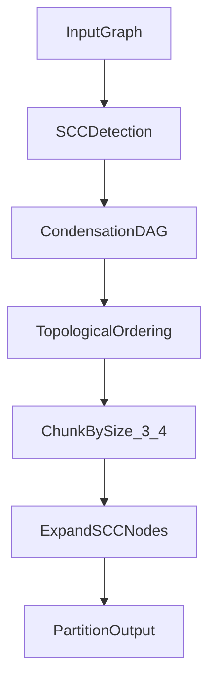
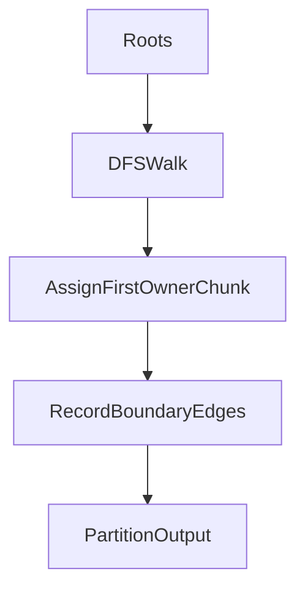
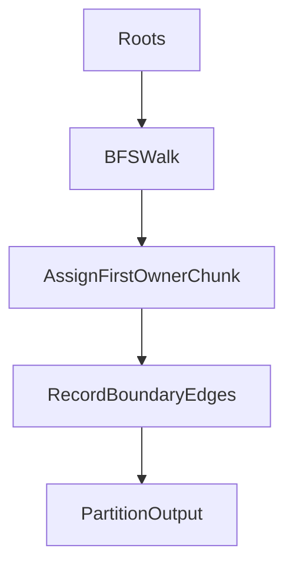
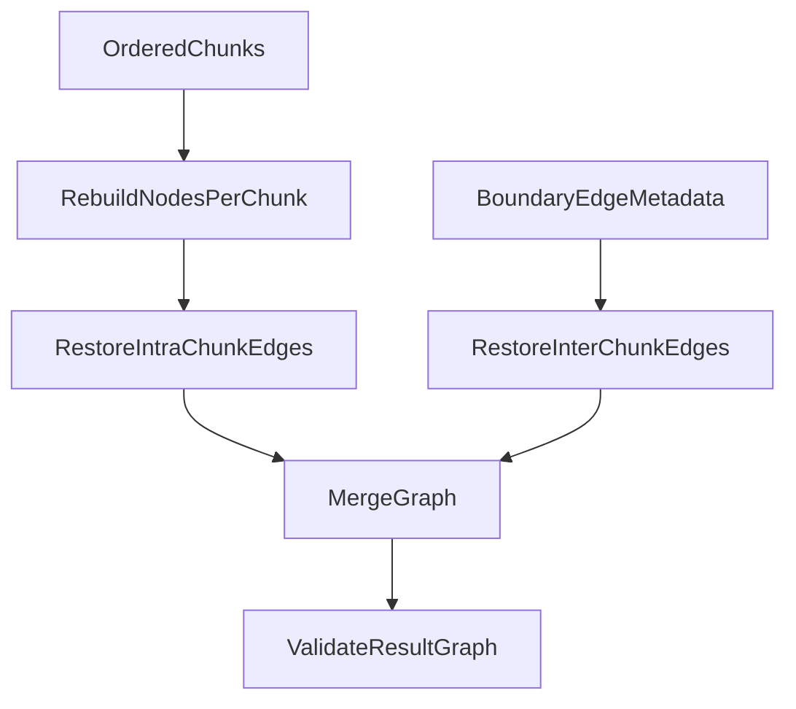
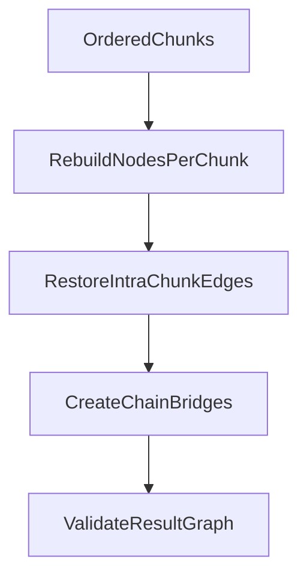
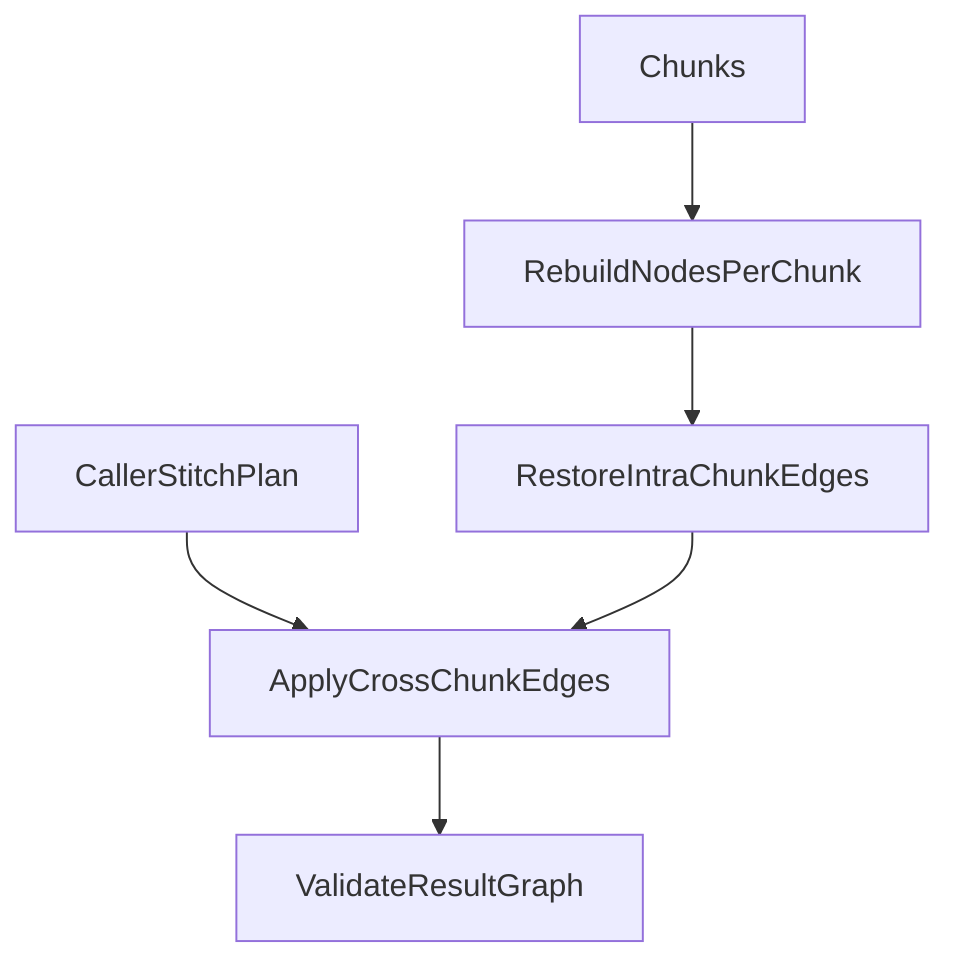

# Partition and Stitch Options

This document compares the available design options for:
- partitioning a directed graph into subtree chunks (target chunk size 3-4),
- stitching chunks back into a valid graph.

The graph model assumed here is:
- directed,
- unweighted,
- node payload in `attributes`,
- cycles allowed.

## Problem Framing

Partitioning needs to answer:
- how to assign each node to a chunk,
- how to handle cycles and shared descendants,
- how to preserve enough metadata for reconstruction.

Stitching needs to answer:
- what the `order` input means,
- whether reconstruction is exact round-trip or approximation.

---

## Partitioning Options

## Option A: Condense SCCs, Then Chunk (recommended)

### Idea
- Compute SCCs (strongly connected components).
- Collapse each SCC into a super-node.
- Partition the resulting condensation DAG into chunks of size 3-4.
- Expand back from SCC super-nodes to original node sets.

### Diagram

### Why it is strong
- Handles cycles explicitly and safely.
- Guarantees deterministic ownership if ordering is fixed.
- Keeps mutually dependent nodes together.
- Produces clean inter-chunk edge metadata from DAG boundaries.

### Tradeoffs
- A single SCC can exceed chunk size target.
- Slightly higher algorithmic complexity than naive traversal chunking.

---

## Option B: DFS First-Visit Ownership

### Idea
- Traverse from root(s) using DFS.
- First chunk that visits a node owns it.
- Remaining visits become cross-chunk boundary edges.

### Diagram

### Why teams choose it
- Very simple implementation.
- Fast and easy to reason about.
- Naturally aligned with existing DFS-based terminal ordering.

### Tradeoffs
- Ownership depends on DFS order.
- Cycles are not modeled as a semantic unit.
- Different root/edge insertion orders can alter partition shapes.

---

## Option C: BFS First-Visit Ownership

### Idea
- Traverse level-by-level from root(s).
- First chunk that visits a node owns it.
- Later visits become cross-chunk boundary edges.

### Diagram

### Why teams choose it
- Produces level-oriented chunking (often intuitive for layered graphs).
- Simple and performant.

### Tradeoffs
- Still order-sensitive.
- Does not preserve SCC semantic boundaries.
- Shared-descendant assignment can feel arbitrary in dense graphs.

---

## Stitching Options

## Option 1: Ordered Chunks + Saved Boundary Edges (exact round-trip)

### Contract
- Input includes:
  - ordered chunk list,
  - boundary edge metadata captured during partition (`fromNodeId`, `toNodeId`).
- Stitch reconstructs all intra-chunk edges plus recorded inter-chunk edges.

### Diagram

### Result
- Best fidelity for round-trip partition -> stitch -> original-equivalent graph.

---

## Option 2: Ordered Chunks Only, Chain Connect

### Contract
- Input includes only ordered chunk list.
- Stitch creates chain links (for example terminal of chunk `i` to root of chunk `i+1`).

### Diagram

### Result
- Produces a valid graph, but not exact original reconstruction.

---

## Option 3: Explicit Caller Stitch Plan

### Contract
- Input includes:
  - chunk list,
  - explicit stitch edge plan from caller.
- Stitch applies caller edges after rebuilding chunks.

### Diagram

### Result
- Most flexible but depends on caller quality and validation rigor.

---

## Comparison Summary

- Best default for general directed graphs with cycles:
  - Partition: **Option A (SCC condense then chunk)**.
  - Stitch: **Option 1 (ordered chunks + boundary metadata)**.
- Fastest simple implementation:
  - Partition: Option B or C.
  - Stitch: Option 2.
- Most customizable:
  - Stitch: Option 3.

## Suggested Default Contract

- `partitionGraph({ chunkSize: 3 | 4, rootIds? })`
- returns:
  - `chunkSize`,
  - `strategy` (`"scc-condense"`),
  - `chunks` (ordered, each with `chunkId`, `kind`, `nodes`, `intraChunkEdges`),
  - `boundaryEdges`,
  - `metadata` (`sccCount`, `chunkCount`, `nodeCount`, `edgeCount`).

- `Graph.stitchGraph({ chunks, boundaryEdges, order? })`
- returns:
  - `graph`,
  - `validation`,
  - `edgeCount`.

---

## Implemented Selection

The library now implements:
- Partition: **Option A (SCC condense then chunk)**.
- Stitch: **Option 1 (ordered chunks + boundary metadata)**.

Operational guarantees in the current implementation:
- Deterministic SCC detection and condensation DAG ordering.
- Chunking target of 3/4 while preserving SCC atomicity.
- Boundary edges persisted as explicit `(fromNodeId, toNodeId, fromChunkId, toChunkId)` records.
- Exact topology reconstruction during stitch by replaying intra-chunk + boundary edges.
- Stitch order is validated strictly; invalid order inputs fail fast.
