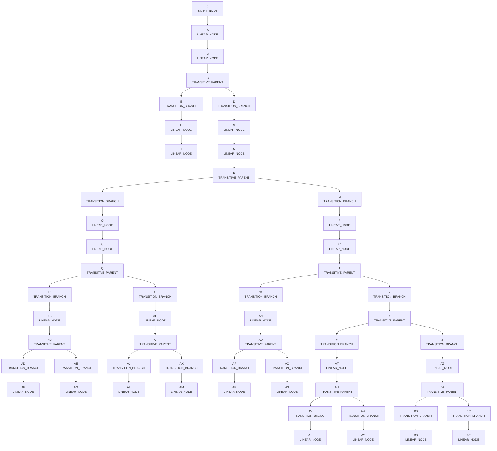

# Graph Library Usage Guide

This guide explains how to use the graph library in day-to-day code, what behavior to expect, and how partition/stitch works.

## What this library models
- Directed, unweighted graphs.
- Node shape: `{ id: string, attributes: TAttributes }`.
- Cycles are valid and supported.
- Deterministic traversal/order behavior is preserved where possible.

## Quickstart
```ts
import { Graph } from "graph-lib";

type NodeAttributes = { label: string; score: number };
const graph = new Graph<NodeAttributes>();

graph.addNode("A", { label: "alpha", score: 1 });
graph.addNode("B", { label: "beta", score: 2 });
graph.addEdge("A", "B");
```

## Mental model
- Think of `Graph` as the high-level API surface.
- Nodes are stored by ID.
- Edges are directed (`from -> to`).
- Most write operations fail fast when node IDs are invalid.
- Validation is explicit (`validate()`), not automatic on every call.

## Common operation flows

### 1) Build and evolve a graph
- Use `addNode(id, attributes)` to create nodes.
- Use `addEdge(from, to)` to connect nodes.
- Use `updateNodeAttributes(id, next)` to replace or derive attributes.
- Use `removeEdge(from, to)` to disconnect specific relationships.
- Use `removeNode(id, { reconnect? })` to delete nodes:
  - default: detach incident edges
  - reconnect mode: connect each old parent to each old child

### 2) Re-parent a region
- Use `moveSubtree(rootId, newParentId, options?)` to attach a node to a new parent.
- `detachFromAllParents: true` removes all existing incoming parent edges first.
- `fromParentId` detaches only one specific parent edge.
- Returns `{ rootId, attachedToParentId, detachedParentIds }`.

### 3) Analyze shape and endpoints
- `classifyReachabilitySubgraph(rootId)` returns:
  - `linear`: no branching in reachable induced subgraph
  - `transitive`: branching exists
- `getTerminalNodes(rootId)` returns deterministic terminal nodes.
- `getLeftmostTerminal`, `getRightmostTerminal`, and `getTerminalByIndex` are convenience accessors over the same deterministic order.

## Partition and merge (stitch)

### When to use this
Use partition/stitch when you need to split a graph into stable chunks, process chunks independently, then merge back to a valid equivalent graph.

### Partition behavior
- Call `partitionGraph({ chunkSize: 3 | 4, rootIds? })`.
- Strategy used: SCC-condense then chunk.
- SCCs are atomic (never split across chunks).
- Result includes:
  - ordered `chunks`,
  - `boundaryEdges` (cross-chunk edges),
  - `metadata` (`sccCount`, `chunkCount`, `nodeCount`, `edgeCount`).
- Chunk shape:
  - `chunkId`
  - `kind` (`linear` | `transitive`)
  - `nodes`
  - `intraChunkEdges`

### Merge behavior
- Call `Graph.stitchGraph({ chunks, boundaryEdges, order? })`.
- This is the library merge operation.
- Stitch rebuilds:
  - all nodes with original attributes,
  - all intra-chunk edges,
  - all boundary edges.
- Returns `{ graph, validation, edgeCount }`.

### Round-trip example
```ts
const partition = graph.partitionGraph({ chunkSize: 3 });

const merged = Graph.stitchGraph({
  chunks: partition.chunks,
  boundaryEdges: partition.boundaryEdges,
  order: partition.chunks.map((chunk) => chunk.chunkId),
});

console.log(merged.validation.isValid);
```

## Mermaid diagrams (rich_complex)

### 1) Original graph


### 2) Partitioned graph (chunk size 3)

```mermaid
flowchart TD
  chunk_node_chunk_0["chunk-0\nlinear\nsize=3"]
  chunk_node_chunk_1["chunk-1\ntransitive\nsize=3"]
  chunk_node_chunk_2["chunk-2\nlinear\nsize=2"]
  chunk_node_chunk_3["chunk-3\ntransitive\nsize=3"]
  chunk_node_chunk_4["chunk-4\nlinear\nsize=2"]
  chunk_node_chunk_5["chunk-5\ntransitive\nsize=3"]
  chunk_node_chunk_6["chunk-6\nlinear\nsize=1"]
  chunk_node_chunk_7["chunk-7\ntransitive\nsize=3"]
  chunk_node_chunk_8["chunk-8\nlinear\nsize=2"]
  chunk_node_chunk_9["chunk-9\ntransitive\nsize=3"]
  chunk_node_chunk_10["chunk-10\nlinear\nsize=2"]
  chunk_node_chunk_11["chunk-11\nlinear\nsize=2"]
  chunk_node_chunk_12["chunk-12\ntransitive\nsize=3"]
  chunk_node_chunk_13["chunk-13\ntransitive\nsize=3"]
  chunk_node_chunk_14["chunk-14\nlinear\nsize=2"]
  chunk_node_chunk_15["chunk-15\ntransitive\nsize=3"]
  chunk_node_chunk_16["chunk-16\nlinear\nsize=3"]
  chunk_node_chunk_17["chunk-17\ntransitive\nsize=3"]
  chunk_node_chunk_18["chunk-18\nlinear\nsize=3"]
  chunk_node_chunk_19["chunk-19\ntransitive\nsize=3"]
  chunk_node_chunk_20["chunk-20\nlinear\nsize=2"]
  chunk_node_chunk_21["chunk-21\nlinear\nsize=2"]
  chunk_node_chunk_0 -->|"boundary"| chunk_node_chunk_1
  chunk_node_chunk_1 -->|"boundary"| chunk_node_chunk_2
  chunk_node_chunk_1 -->|"boundary"| chunk_node_chunk_21
  chunk_node_chunk_3 -->|"boundary"| chunk_node_chunk_4
  chunk_node_chunk_3 -->|"boundary"| chunk_node_chunk_11
  chunk_node_chunk_2 -->|"boundary"| chunk_node_chunk_3
  chunk_node_chunk_4 -->|"boundary"| chunk_node_chunk_5
  chunk_node_chunk_5 -->|"boundary"| chunk_node_chunk_6
  chunk_node_chunk_5 -->|"boundary"| chunk_node_chunk_10
  chunk_node_chunk_11 -->|"boundary"| chunk_node_chunk_12
  chunk_node_chunk_12 -->|"boundary"| chunk_node_chunk_13
  chunk_node_chunk_12 -->|"boundary"| chunk_node_chunk_18
  chunk_node_chunk_13 -->|"boundary"| chunk_node_chunk_14
  chunk_node_chunk_13 -->|"boundary"| chunk_node_chunk_16
  chunk_node_chunk_6 -->|"boundary"| chunk_node_chunk_7
  chunk_node_chunk_7 -->|"boundary"| chunk_node_chunk_8
  chunk_node_chunk_10 -->|"boundary"| chunk_node_chunk_9
  chunk_node_chunk_9 -->|"boundary"| chunk_node_chunk_10
  chunk_node_chunk_9 -->|"boundary"| chunk_node_chunk_14
  chunk_node_chunk_18 -->|"boundary"| chunk_node_chunk_19
  chunk_node_chunk_19 -->|"boundary"| chunk_node_chunk_20
  chunk_node_chunk_14 -->|"boundary"| chunk_node_chunk_15
  chunk_node_chunk_15 -->|"boundary"| chunk_node_chunk_16
  chunk_node_chunk_16 -->|"boundary"| chunk_node_chunk_17
  chunk_node_chunk_17 -->|"boundary"| chunk_node_chunk_18

  %% Detailed node-level partition layout
  subgraph chunk_chunk_0 [chunk-0_linear]
    node_A["A\nLINEAR_NODE"]
    node_B["B\nLINEAR_NODE"]
    node_J["J\nSTART_NODE"]
  end
  subgraph chunk_chunk_1 [chunk-1_transitive]
    node_C["C\nTRANSITIVE_PARENT"]
    node_D["D\nTRANSITION_BRANCH"]
    node_E["E\nTRANSITION_BRANCH"]
  end
  subgraph chunk_chunk_2 [chunk-2_linear]
    node_G["G\nLINEAR_NODE"]
    node_N["N\nLINEAR_NODE"]
  end
  subgraph chunk_chunk_3 [chunk-3_transitive]
    node_K["K\nTRANSITIVE_PARENT"]
    node_L["L\nTRANSITION_BRANCH"]
    node_M["M\nTRANSITION_BRANCH"]
  end
  subgraph chunk_chunk_4 [chunk-4_linear]
    node_O["O\nLINEAR_NODE"]
    node_U["U\nLINEAR_NODE"]
  end
  subgraph chunk_chunk_5 [chunk-5_transitive]
    node_Q["Q\nTRANSITIVE_PARENT"]
    node_R["R\nTRANSITION_BRANCH"]
    node_S["S\nTRANSITION_BRANCH"]
  end
  subgraph chunk_chunk_6 [chunk-6_linear]
    node_AB["AB\nLINEAR_NODE"]
  end
  subgraph chunk_chunk_7 [chunk-7_transitive]
    node_AC["AC\nTRANSITIVE_PARENT"]
    node_AD["AD\nTRANSITION_BRANCH"]
    node_AE["AE\nTRANSITION_BRANCH"]
  end
  subgraph chunk_chunk_8 [chunk-8_linear]
    node_AF["AF\nLINEAR_NODE"]
    node_AG["AG\nLINEAR_NODE"]
  end
  subgraph chunk_chunk_9 [chunk-9_transitive]
    node_AI["AI\nTRANSITIVE_PARENT"]
    node_AJ["AJ\nTRANSITION_BRANCH"]
    node_AK["AK\nTRANSITION_BRANCH"]
  end
  subgraph chunk_chunk_10 [chunk-10_linear]
    node_AH["AH\nLINEAR_NODE"]
    node_AL["AL\nLINEAR_NODE"]
  end
  subgraph chunk_chunk_11 [chunk-11_linear]
    node_AA["AA\nLINEAR_NODE"]
    node_P["P\nLINEAR_NODE"]
  end
  subgraph chunk_chunk_12 [chunk-12_transitive]
    node_T["T\nTRANSITIVE_PARENT"]
    node_V["V\nTRANSITION_BRANCH"]
    node_W["W\nTRANSITION_BRANCH"]
  end
  subgraph chunk_chunk_13 [chunk-13_transitive]
    node_X["X\nTRANSITIVE_PARENT"]
    node_Y["Y\nTRANSITION_BRANCH"]
    node_Z["Z\nTRANSITION_BRANCH"]
  end
  subgraph chunk_chunk_14 [chunk-14_linear]
    node_AM["AM\nLINEAR_NODE"]
    node_AT["AT\nLINEAR_NODE"]
  end
  subgraph chunk_chunk_15 [chunk-15_transitive]
    node_AU["AU\nTRANSITIVE_PARENT"]
    node_AV["AV\nTRANSITION_BRANCH"]
    node_AW["AW\nTRANSITION_BRANCH"]
  end
  subgraph chunk_chunk_16 [chunk-16_linear]
    node_AX["AX\nLINEAR_NODE"]
    node_AY["AY\nLINEAR_NODE"]
    node_AZ["AZ\nLINEAR_NODE"]
  end
  subgraph chunk_chunk_17 [chunk-17_transitive]
    node_BA["BA\nTRANSITIVE_PARENT"]
    node_BB["BB\nTRANSITION_BRANCH"]
    node_BC["BC\nTRANSITION_BRANCH"]
  end
  subgraph chunk_chunk_18 [chunk-18_linear]
    node_AN["AN\nLINEAR_NODE"]
    node_BD["BD\nLINEAR_NODE"]
    node_BE["BE\nLINEAR_NODE"]
  end
  subgraph chunk_chunk_19 [chunk-19_transitive]
    node_AO["AO\nTRANSITIVE_PARENT"]
    node_AP["AP\nTRANSITION_BRANCH"]
    node_AQ["AQ\nTRANSITION_BRANCH"]
  end
  subgraph chunk_chunk_20 [chunk-20_linear]
    node_AR["AR\nLINEAR_NODE"]
    node_AS["AS\nLINEAR_NODE"]
  end
  subgraph chunk_chunk_21 [chunk-21_linear]
    node_H["H\nLINEAR_NODE"]
    node_I["I\nLINEAR_NODE"]
  end
  node_A --> node_B
  node_AC --> node_AD
  node_AC --> node_AE
  node_AI --> node_AJ
  node_AI --> node_AK
  node_AO --> node_AP
  node_AO --> node_AQ
  node_AU --> node_AV
  node_AU --> node_AW
  node_BA --> node_BB
  node_BA --> node_BC
  node_C --> node_D
  node_C --> node_E
  node_G --> node_N
  node_H --> node_I
  node_J --> node_A
  node_K --> node_L
  node_K --> node_M
  node_O --> node_U
  node_P --> node_AA
  node_Q --> node_R
  node_Q --> node_S
  node_T --> node_V
  node_T --> node_W
  node_X --> node_Y
  node_X --> node_Z
  node_AA -->|"boundary"| node_T
  node_AB -->|"boundary"| node_AC
  node_AD -->|"boundary"| node_AF
  node_AE -->|"boundary"| node_AG
  node_AH -->|"boundary"| node_AI
  node_AJ -->|"boundary"| node_AL
  node_AK -->|"boundary"| node_AM
  node_AN -->|"boundary"| node_AO
  node_AP -->|"boundary"| node_AR
  node_AQ -->|"boundary"| node_AS
  node_AT -->|"boundary"| node_AU
  node_AV -->|"boundary"| node_AX
  node_AW -->|"boundary"| node_AY
  node_AZ -->|"boundary"| node_BA
  node_B -->|"boundary"| node_C
  node_BB -->|"boundary"| node_BD
  node_BC -->|"boundary"| node_BE
  node_D -->|"boundary"| node_G
  node_E -->|"boundary"| node_H
  node_L -->|"boundary"| node_O
  node_M -->|"boundary"| node_P
  node_N -->|"boundary"| node_K
  node_R -->|"boundary"| node_AB
  node_S -->|"boundary"| node_AH
  node_U -->|"boundary"| node_Q
  node_V -->|"boundary"| node_X
  node_W -->|"boundary"| node_AN
  node_Y -->|"boundary"| node_AT
  node_Z -->|"boundary"| node_AZ
```


### 3) Stitched (merged) graph


## Return-value and error semantics
- `addEdge` returns `true` if inserted, `false` if already present.
- `removeEdge` returns `true` if removed, `false` if absent.
- Operations that reference missing nodes throw errors.
- Stitch throws on invalid `order` (unknown or duplicate chunk IDs).
- Stitch throws if chunk content is structurally inconsistent (such as duplicated node IDs across chunks).

## Validation and integrity
- `validate()` returns:
  - `isValid`
  - `issues`
  - `errorCount`
  - `warningCount`
- Referential integrity issues are errors.
- Cycle detection is surfaced as a warning in v1.

## Telemetry hooks
Pass telemetry through `new Graph({ telemetry })`:
- `onOperationStart`
- `onOperationSuccess`
- `onOperationFailure`

Telemetry is optional and no-op by default.

## Notes
- If an SCC exceeds `chunkSize`, that chunk can exceed the target size.
- Providing `order` to stitch gives deterministic chunk processing order.

## Driver pipeline (`src/run.ts`)
- The repository includes a main driver at `src/run.ts` that:
  - builds multiple complex scenarios,
  - runs validate -> partition -> stitch -> validate,
  - prints analysis summaries to console,
  - emits Mermaid files for original/partition/stitched views.
- Run it with:
  - `npm run build`
  - `node dist/run.js`
- Mermaid output is written under:
  - `docs/generated/run-driver/`
